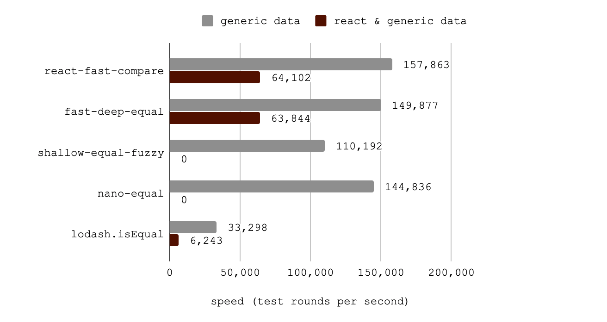

# react-fast-compare

[![Downloads][downloads_img]][npm_site]
[![size_minzip][size_minzip]][size_site]
[![Travis Status][trav_img]][trav_site]
[![AppVeyor Status][appveyor_img]][appveyor_site]
[![npm version][npm_img]][npm_site]
[![Maintenance Status][maintenance-image]](#maintenance-status)


The fastest deep equal comparison for React. Really fast general-purpose deep comparison.
Great for`shouldComponentUpdate`. This is a fork of the brilliant
[fast-deep-equal](https://github.com/epoberezkin/fast-deep-equal) with some
extra handling for React.




(Check out the [benchmarking details](#benchmarking-this-library).)

## Install

```sh
$ yarn add react-fast-compare
# or
$ npm install react-fast-compare
```

## Highlights

* ES5 compatible; works in node.js (0.10+) and browsers (IE9+)
* deeply compares any value (besides objects with circular references)
* handles React-specific circular references, like elements
* checks equality Date and RegExp objects
* should as fast as [fast-deep-equal](https://github.com/epoberezkin/fast-deep-equal) via a single unified library, and with added guardrails for circular references.
* small: under 700 bytes minified+gzipped

## Usage

```jsx
const isEqual = require("react-fast-compare");

// general usage
console.log(isEqual({ foo: "bar" }, { foo: "bar" })); // true

// react usage
class ExpensiveRenderer extends React.Component {
  shouldComponentUpdate(nextProps) {
    return !isEqual(this.props, nextProps);
  }
  render() {
    // ...
  }
}
```

## Do I Need `shouldComponentUpdate`?

> What's faster than a really fast deep comparison? No deep comparison at all.

—This Readme

Deep checks in React's `shouldComponentUpdate` should not be used blindly.
First, see if a
[PureComponent](https://reactjs.org/docs/react-api.html#reactpurecomponent)
would work for you. If it won't (if you need deep checks), it's wise to make
sure you've correctly indentified the bottleneck in your application by
[profiling the performance](https://reactjs.org/docs/optimizing-performance.html#profiling-components-with-the-chrome-performance-tab).
After you've determined that you _do_ need deep equality checks and you've
identified the minimum number of places to apply them, then this library may
be for you! For more information about making your app faster, check out the
[Optimizing Performance](https://reactjs.org/docs/optimizing-performance.html)
section of the React docs.

## Benchmarking this Library

All tests carried out locally on a MacBook. The absolute values are much less
important than the relative differences between packages.

Benchmarking source can be found
[here](https://github.com/FormidableLabs/react-fast-compare/blob/master/benchmark/index.js).
Each "operation" consists of running all relevant tests. The React benchmark
uses both the generic tests and the react tests; these runs will be slower
simply because there are more tests in each operation.

### Generic Data

```
react-fast-compare x 157,863 ops/sec ±0.54% (94 runs sampled)
fast-deep-equal x 149,877 ops/sec ±0.76% (93 runs sampled)
lodash.isEqual x 33,298 ops/sec ±0.70% (93 runs sampled)
nano-equal x 144,836 ops/sec ±0.51% (94 runs sampled)
shallow-equal-fuzzy x 110,192 ops/sec ±0.57% (95 runs sampled)
  fastest: react-fast-compare
```

`react-fast-compare` and `fast-deep-equal` should be the same speed for these
tests; any difference is just noise. `react-fast-compare` won't be faster than
`fast-deep-equal`, because it's based on it.

### React and Generic Data

```
react-fast-compare x 64,102 ops/sec ±0.36% (94 runs sampled)
fast-deep-equal x 63,844 ops/sec ±0.43% (94 runs sampled)
lodash.isEqual x 6,243 ops/sec ±0.72% (90 runs sampled)
  fastest: react-fast-compare,fast-deep-equal
```

Two of these packages cannot handle comparing React elements (which are
circular): `nano-equal` and `shallow-equal-fuzzy`.

### Running Benchmarks

```sh
$ yarn install
$ yarn run benchmark
```

## fast-deep-equal Versioning

react-fast-compare@3 tracks fast-deep-equal@3.1.1

Now that `fast-deep-equal` has separate es5, es6, and es6 + React entry points, the main differences with this library are:

* `try/catch` guardrails for stack overflows from undetected circular references.
* A single unified entry point for **all** uses. No matter what your target application is, `import equal fro 'react-fast-compare'` just works.

## License

[MIT](https://github.com/FormidableLabs/react-fast-compare/blob/readme/LICENSE)

## Contributing

Please see our [contributions guide](./CONTRIBUTING.md).

## Maintenance Status

**Active:** Formidable is actively working on this project, and we expect to continue for work for the foreseeable future. Bug reports, feature requests and pull requests are welcome.

[trav_img]: https://api.travis-ci.org/FormidableLabs/react-fast-compare.svg
[trav_site]: https://travis-ci.org/FormidableLabs/react-fast-compare
[cov_img]: https://img.shields.io/coveralls/FormidableLabs/react-fast-compare.svg
[cov_site]: https://coveralls.io/r/FormidableLabs/react-fast-compare
[npm_img]: https://badge.fury.io/js/react-fast-compare.svg
[npm_site]: http://badge.fury.io/js/react-fast-compare
[appveyor_img]: https://ci.appveyor.com/api/projects/status/github/formidablelabs/react-fast-compare?branch=master&svg=true
[appveyor_site]: https://ci.appveyor.com/project/FormidableLabs/react-fast-compare
[size_min]: https://img.shields.io/bundlephobia/min/react-fast-compare.svg
[size_minzip]: https://img.shields.io/bundlephobia/minzip/react-fast-compare.svg
[size_site]: https://bundlephobia.com/result?p=react-fast-compare
[downloads_img]: https://img.shields.io/npm/dt/react-fast-compare.svg
[maintenance-image]: https://img.shields.io/badge/maintenance-active-green.svg
